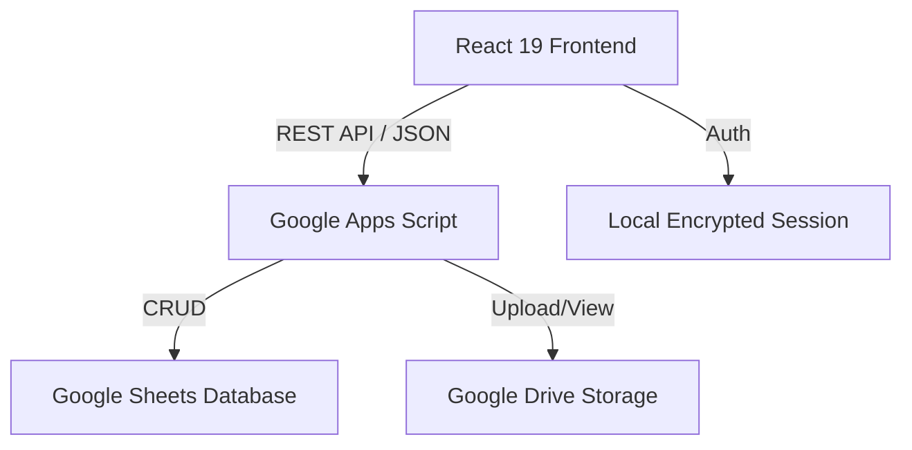

# Product Requirement Document (PRD): ระบบจัดการ Rework QSMS

**สถานะเอกสาร:** ฉบับร่าง (Draft)  
**วันที่แก้ไขล่าสุด:** 2026-05-11  
**ผู้จัดทำ:** Antigravity AI

---

## 1. ข้อมูลภาพรวมของโปรเจกต์ (Project Overview)
ระบบจัดการ Rework QSMS คือเว็บแอปพลิเคชันที่ออกแบบมาเพื่อจัดการ ติดตาม และวิเคราะห์รายการสินค้าที่ต้องทำการแก้ไข (Rework) ภายในองค์กร โดยเน้นการทำงานร่วมกันระหว่างแผนก QSMS, คลังสินค้า (WFG), และฝ่ายการเงิน (Finance) เพื่อให้ข้อมูลมีความถูกต้อง ตรวจสอบได้ และลดการสูญเสียในระยะยาว

### วัตถุประสงค์ (Objectives)
- เพื่อใช้เป็นฐานข้อมูลกลางในการบันทึกรายการ Rework
- เพื่อลดขั้นตอนการทำงานด้วยกระดาษและใช้ระบบ Digital Workflow แทน
- เพื่อให้ฝ่ายการเงินสามารถประเมินราคาความเสียหายได้อย่างรวดเร็ว
- เพื่อนำข้อมูลมาวิเคราะห์สาเหตุ (Root Cause Analysis) ผ่าน Dashboard

---

## 2. บทบาทผู้ใช้งานและสิทธิ์การเข้าถึง (User Roles & RBAC)
ระบบใช้รหัสผ่านในการแยกบทบาทผู้ใช้งาน (Role-Based Access Control):

| บทบาท (Role) | สิทธิ์การใช้งาน (Permissions) |
| :--- | :--- |
| **Admin / QSMS** | เข้าถึงได้ทุกฟีเจอร์ (Dashboard, Add, Overall, Update, Delete, Edit All) |
| **WFG (Warehouse)** | เพิ่มเคสใหม่, ดูหน้า Overall, อัปเดตวิธีแก้ไขปัญหา (Resolution) |
| **Finance** | ดูหน้า Overall, ระบุราคาประเมิน (Rework Cost) เท่านั้น |

---

## 3. ฟีเจอร์ที่สำคัญ (Key Features)

### 3.1 ระบบจัดการเคส (Case Management)
- **การเพิ่มข้อมูล (Multi-item Support):** บันทึกได้หลายรายการสินค้าใน 1 เคส (Master-Detail Structure)
- **ข้อมูลที่บันทึก:** แหล่งที่มา, วันที่, ผู้รับผิดชอบ, Item No., Batch No. (ตัวเลข), จำนวน, และสาเหตุ
- **ระบบจัดกลุ่มสาเหตุ:** 
    - สาเหตุหลัก: รั่ว, เปื้อน, อื่นๆ
    - สาเหตุย่อย: เช่น แตกตะเข็บ, ขวดเปื้อน (สามารถเลือกได้หลายอย่างสำหรับ "เปื้อน")
- **ความเชื่อมโยง (Cross-Item Linkage):** ระบุได้ว่าสินค้าที่เปื้อนเกิดจากการรั่วของสินค้าอีกรายการในเคสเดียวกัน
- **การจัดการรูปภาพ:** อัปโหลดและแสดงผลรูปภาพหลักฐานจาก Google Drive

### 3.2 เวิร์กโฟลว์การทำงาน (Workflow)
ระบบจะเปลี่ยนสถานะอัตโนมัติตามการกรอกข้อมูล:
1. **Pending:** เมื่อสร้างเคสใหม่
2. **In-Progress:** เมื่อมีการเปิดดูหรือเริ่มดำเนินการ
3. **Awaiting Valuation:** เมื่อ WFG/QSMS ระบุ "วิธีแก้ไขปัญหา" เสร็จสิ้น
4. **Completed:** เมื่อ Finance ระบุ "ราคาประเมิน" เรียบร้อย

### 3.3 การวิเคราะห์ข้อมูล (Dashboard & Analytics)
- **KPI Cards:** สรุปจำนวนเคสทั้งหมด, งานค้าง, และสถิติรายวัน
- **Dual-View Chart:** สลับดูตาม "ปริมาณสินค้า (Units)" หรือ "ความถี่ของสาเหตุ (Defects)"
- **Drill-down:** คลิกที่สาเหตุหลักเพื่อดูสถิติสาเหตุย่อย

### 3.4 ระบบส่งออก (Export System)
- รองรับการ Export รายละเอียดเคสเป็นรูปภาพ (Long Image) หรือ PDF เพื่อใช้ประกอบเอกสารอย่างเป็นทางการ

---

## 4. สถาปัตยกรรมทางเทคนิค (Technical Architecture)

- **Frontend:** React 19, Vite, Tailwind CSS 4, Framer Motion, Recharts
- **Backend:** Google Apps Script (GAS) ทำหน้าที่เป็น Web App API
- **Database:** Google Sheets (ใช้เป็นฐานข้อมูลแบบแถว)

---

## 5. โครงสร้างข้อมูล (Data Schema - Google Sheets)
| คอลัมน์ | คำอธิบาย |
| :--- | :--- |
| **ID** | Unique ID ของเคส |
| **Date** | วันที่เกิดเหตุ (Asia/Bangkok) |
| **Source** | แหล่งที่มาของปัญหา |
| **Item Number** | รหัสสินค้า |
| **Batch No.** | หมายเลข Batch ผลิต |
| **Amount** | จำนวนสินค้า (หน่วย: กล่อง/ชิ้น) |
| **Reason** | สาเหตุหลัก (รั่ว/เปื้อน/อื่นๆ) |
| **Subtype** | สาเหตุย่อย (Comma separated) |
| **Status** | สถานะปัจจุบัน |
| **Resolution** | วิธีการแก้ไขปัญหา |
| **Cost** | ราคาประเมินความเสียหาย |
| **Images** | ลิงก์รูปภาพใน Google Drive |

---

## 6. แผนการทดสอบ (Testing Strategy)
เพื่อให้มั่นใจว่าระบบทำงานได้ถูกต้องตาม PRD:
- **Functional Testing:** ตรวจสอบการ Validation ของ Batch No. (ต้องเป็นตัวเลข) และ Multi-item logic
- **Workflow Testing:** ทดสอบการเปลี่ยนสถานะตามบทบาทผู้ใช้
- **Performance Testing:** การแสดงผลตารางที่มีข้อมูลมากกว่า 500 แถว และความเร็วในการโหลด Dashboard
- **Security Testing:** การเข้าถึงเมนูที่ไม่อนุญาตสำหรับบทบาท Finance และ WFG

---

## 7. คู่มือสำหรับ Testsprite (Autonomous Testing Specification)
Testsprite ควรมุ่งเน้นการทดสอบ "Golden Path" ดังนี้:
1. Login ด้วยบทบาท QSMS
2. สร้างเคสใหม่ที่มี 2 ไอเทม (1 รั่ว, 1 เปื้อน) และเชื่อมโยงกัน
3. บันทึกและตรวจสอบว่าข้อมูลแสดงผลในหน้า Overall
4. Login ด้วยบทบาท Finance และลองเข้าหน้า Dashboard (ต้องเข้าไม่ได้)
5. อัปเดตสถานะจนจบ Workflow และตรวจสอบค่า Cost ใน Sheet
