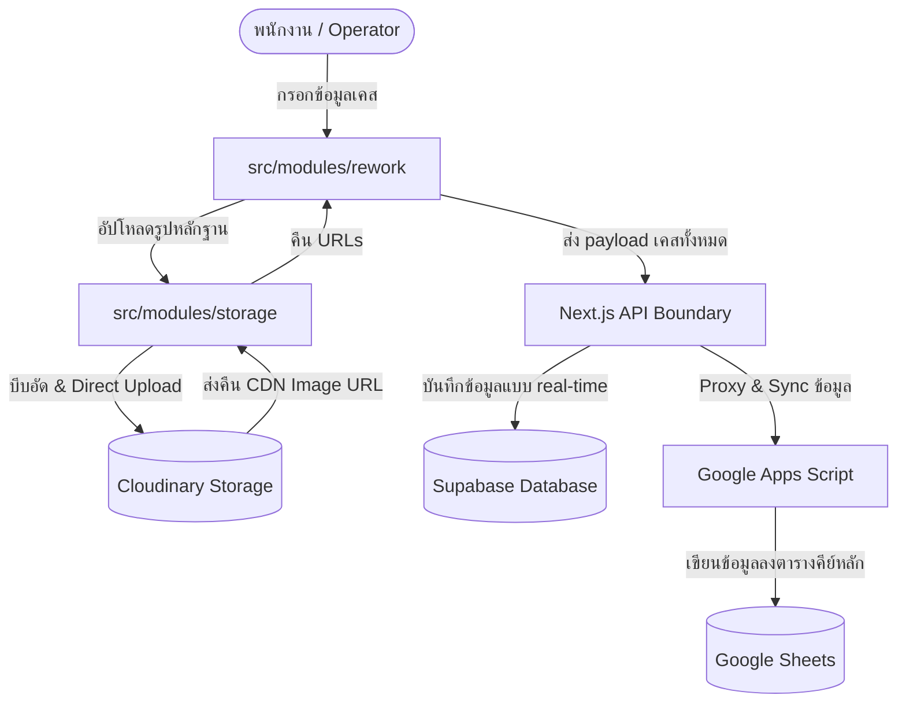

# Title: โครงสร้างและการทำงานของแต่ละโมดูล (Modular Breakdown)
[Updated: 2026-07-14]

## 1. Summary
โปรเจกต์ QSMS ได้จัดสรรแบ่งกลุ่ม Business Logic ออกเป็น **7 โมดูลหลัก** ภายใต้โฟลเดอร์ `src/modules/` ตามสถาปัตยกรรมแบบ Feature-Sliced Design (FSD) ประยุกต์ เพื่อลดการผูกมัดโค้ดอย่างแนบแน่น (Tight Coupling) และเพิ่มความง่ายในการควบคุมคุณภาพและการตรวจสอบแบบ Unit Testing/E2E

---

## 2. Key Details

### ตารางสรุปโมดูลและหน้าที่เชิงวิศวกรรม

| โมดูล (Module Slice) | เส้นทาง (Directory) | หน้าที่รับผิดชอบหลัก (Key Responsibilities) | การเชื่อมต่อและความสัมพันธ์ (Dependencies) |
|---|---|---|---|
| **`auth`** | `src/modules/auth/` | • จัดการระบบ Authentication ในหน้าบ้าน (`Login.tsx`, `Register.tsx`)  • สื่อสารกับ Server-state Auth (HTTP-Only Cookie) | • เชื่อมต่อกับ `@/src/services/auth` • ใช้ `@/src/contexts/NotificationContext` แจ้งเตือน |
| **`rework`** | `src/modules/rework/` | • หน้าต่างจัดการหลักสำหรับใบงาน Rework (`AddCaseTab`, `OverallTab`, `DashboardTab`) • จัดการลอจิกซับซ้อนและการตรวจสอบ (Validation) ของ Item และล็อตสินค้า | • เรียกใช้งานโมดูล `@/src/modules/storage` สำหรับภาพหลักฐาน • นำเข้าโมดูล `@/src/modules/drawings` สำหรับสร้าง PDF/Excel |
| **`storage`** | `src/modules/storage/` | • จัดการ Image Upload & Photo Editor • บีบอัดรูปภาพฝั่งไคลเอนต์ (Client-Side Compression ~300KB) • สื่อสารกับ Cloudinary API (Direct Unsigned Upload) | • จัดการรูปภาพส่งกลับเป็นอาร์เรย์ URL ไปให้ `rework` บันทึก |
| **`drawings`** | `src/modules/drawings/` | • จัดทำเอกสารประกอบทางเทคนิคและแบบแปลน (Engineering Drawings) • ออกเอกสาร PDF (`ExportPDFTemplate.tsx`) และ Excel รายงานเคส | • ถูกเรียกใช้งานจาก `OverallTab` เพื่อส่งออกแบบฟอร์ม Rework |
| **`rag`** | `src/modules/rag/` | • บริการคู่มือเทคนิคและแนวทางการแก้ไขงาน Rework อัจฉริยะ (SSE Chat Stream) • สืบค้นข้อมูลความรู้ผ่าน RPC Hybrid Search และ Supabase pgvector | • เชื่อมต่อกับ Supabase Database และ Jina AI Embeddings / Gemini API ในระดับ Server-side |
| **`guide`** | `src/modules/guide/` | • คู่มือแนะนำการใช้งานระบบ (GuideApp) และ Mock Screens ที่จำเป็นสำหรับทดสอบ UI/UX ในระหว่างพัฒนา | • มีการจำลองหน้าจอและ Component ของโมดูลอื่นๆ เช่น `rework`, `auth` |
| **`platform`** | `src/modules/platform/` | • ตัวลงทะเบียนโมดูล/แอปพลิเคชันแบบไดนามิก (`appRegistry.ts`) สำหรับระบบ Portal Shell | • ทำหน้าที่เป็น Entry Register ป้อนหน้าต่างไปแสดงผลใน Portal Layout |

---

## 3. มิติเชิงสถาปัตยกรรม (Architectural Dimensions)

### 3.1 การไหลของข้อมูล (Data Flow Dimension)

### 3.2 กฎการพึ่งพาโมดูล (Module Dependency Boundary Rules)
เพื่อควบคุมไม่ให้เกิด "สปาเก็ตตี้โค้ด" หรือการพึ่งพาแบบย้อนกลับ (Circular Dependency) สถาปัตยกรรม FSD ของโปรเจกต์นี้มีกฎดังนี้:
1. **โมดูล Shared/UI Components (`src/components/`) ห้าม Import โค้ดจาก `src/modules/`**: ชิ้นส่วน UI พื้นฐานต้องเป็นแบบไร้ลอจิก (Stateless / Pure UI) เสมอ
2. **การติดต่อข้ามโมดูลต้องผ่าน Interface หรือ Props เสมอ**: เช่น `rework` จะเรียกแสดงรูปภาพผ่านคอมโพเนนต์อัปโหลดรูปภาพที่ส่ง Props callback กลับมา โดยไม่สืบค้น State ภายในของโมดูลเก็บไฟล์โดยตรง
3. **การนำเข้าระดับสูง (App Shell)**: `src/App.tsx` หรือ `MainLayout.tsx` จะทำหน้าที่ดึง Registry จาก `platform/appRegistry.ts` มาเรนเดอร์และควบคุมสิทธิ์การเข้าถึง (Role-Based Router)

---

## 4. Knowledge Relationships
- Depends On (must read): [[fsd-migration.md]], [[system-architecture.md]]
- Impacted By (changes affect): การเขียนไฟล์ทดสอบ Unit test และ E2E Playwright
