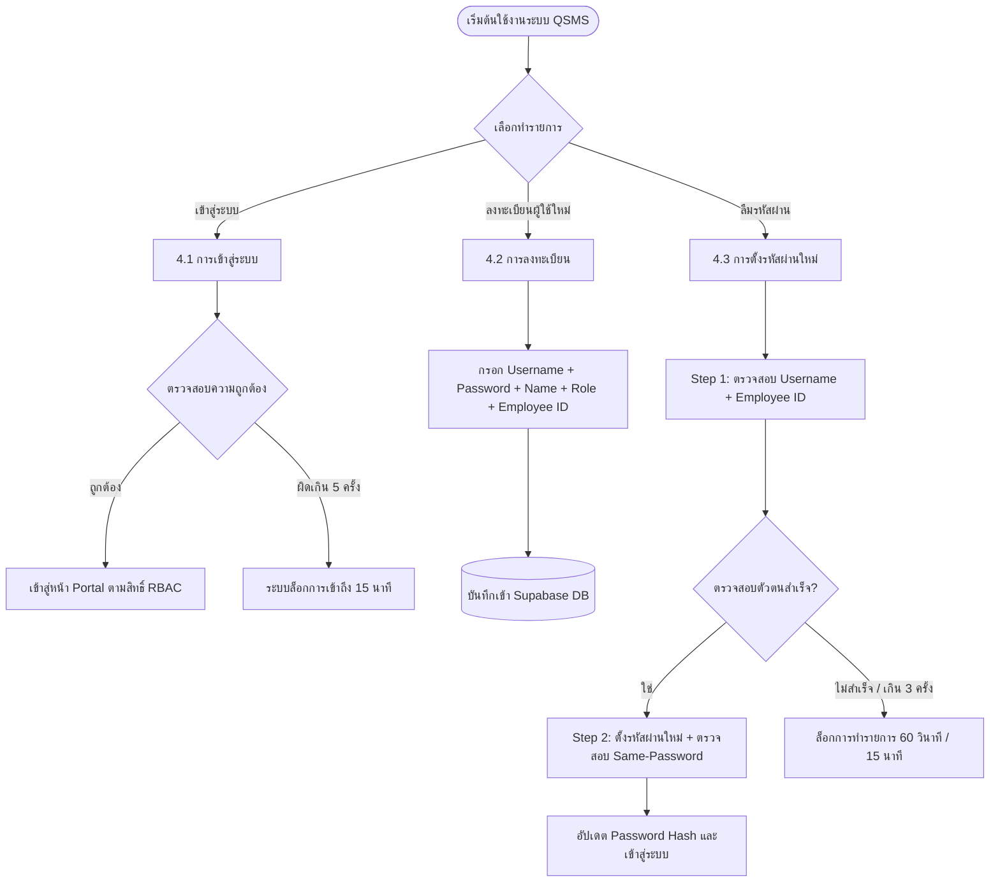

# 📄 เอกสารวิธีปฏิบัติงาน (Work Instruction)

**รหัสเอกสาร**: WI-QSMS-AUTH-001  
**เวอร์ชัน**: 2.0 (ปรับปรุงล่าสุด: 2026-08-05)  
**ชื่อเอกสาร**: วิธีปฏิบัติงานการเข้าสู่ระบบ การลงทะเบียน และการตั้งรหัสผ่านใหม่ (Authentication & RBAC)  
**ผู้อนุมัติเอกสาร**: ผู้จัดการแผนกควบคุมคุณภาพ (QSMS Manager)  

---

## 1. วัตถุประสงค์ (Purpose)
เอกสารฉบับนี้กำหนดขั้นตอนการเข้าสู่ระบบ การลงทะเบียนผู้ใช้ใหม่ และการตั้งรหัสผ่านใหม่แบบ 2 ขั้นตอน (Streamlined 2-Step Password Reset) รวมถึงการควบคุมสิทธิ์การเข้าถึงข้อมูลตามบทบาทหน้าที่ (Role-Based Access Control - RBAC) เพื่อให้มั่นใจในความถูกต้องและความปลอดภัยของข้อมูลตามมาตรฐาน ISO 9001

---

## 2. ขอบเขต (Scope)
ครอบคลุมผู้ใช้งานระบบ **QSMS Rework Management System** ทุกระดับ ได้แก่:
1. **Admin** (ผู้ดูแลระบบ)
2. **QSMS** (เจ้าหน้าที่ควบคุมคุณภาพ)
3. **Operator** (พนักงานปฏิบัติงาน Rework ฝ่ายผลิต)
4. **Management** (ผู้บริหารและฝ่ายจัดการ)

---

## 3. แผนผังภาพรวมกระบวนการ (Visual Process Flowchart)



---

## 4. ขั้นตอนการปฏิบัติงานและหน้าจอ (Operating Procedures & Visual Guides)

### 4.1 การเข้าสู่ระบบ (Login Procedure)

#### ภาพจำลอง UI หน้าจอเข้าสู่ระบบ:
```
┌────────────────────────────────────────────────────────────────────────┐
│                          🔒 QSMS LOGIN SYSTEM                          │
├────────────────────────────────────────────────────────────────────────┤
│                                                                        │
│  Username:    [ admin_qsms                           ]                 │
│  Password:    [ ••••••••••••                         ]                 │
│                                                                        │
│               [  🔘 เข้าสู่ระบบ (Sign In)  ]                             │
│                                                                        │
│  [ ลืมรหัสผ่าน? ]                             [ ลงทะเบียนบัญชีใหม่ ]     │
└────────────────────────────────────────────────────────────────────────┘
```

#### ขั้นตอนการทำงาน:
1. กรอก **ชื่อผู้ใช้ (Username)** และ **รหัสผ่าน (Password)**
2. คลิกปุ่ม **"เข้าสู่ระบบ (Sign In)"**
3. หากกรอกข้อมูลถูกต้อง ระบบจะนำผู้ใช้เข้าสู่หน้าจอ Portal ตามสิทธิ์ของแต่ละบทบาท
4. **มาตรการความปลอดภัย**: หากกรอกรหัสผ่านผิดติดต่อกันเกิน 5 ครั้ง ระบบจะทำการระงับการเข้าถึงชั่วคราวเป็นเวลา 15 นาทีเพื่อป้องกันการสุ่มรหัสผ่าน (Brute-force protection)

---

### 4.2 การลงทะเบียนผู้ใช้ใหม่ (User Registration Procedure)

#### ภาพจำลอง UI หน้าจอลงทะเบียน:
```
┌────────────────────────────────────────────────────────────────────────┐
│                        📝 REGISTER NEW ACCOUNT                         │
├────────────────────────────────────────────────────────────────────────┤
│                                                                        │
│  ชื่อผู้ใช้ (Username):     [ operator_line1                       ]   │
│  ชื่อ-นามสกุล (Full Name):   [ สมชาย ใจดี                           ]   │
│  รหัสพนักงาน (Employee ID):  [ EMP-10045                            ]   │
│  ระดับสิทธิ์ (Role):        [ 🔽 Operator                          ]   │
│  รหัสผ่าน (Password):        [ ••••••••••••                         ]   │
│                                                                        │
│               [  🔘 ยืนยันการลงทะเบียน (Register)  ]                     │
└────────────────────────────────────────────────────────────────────────┘
```

#### ขั้นตอนการทำงาน:
1. คลิกปุ่ม **"ลงทะเบียนบัญชีใหม่"** จากหน้าเข้าสู่ระบบ
2. กรอกข้อมูลจำเป็นให้ครบถ้วนทั้ง 5 ฟิลด์:
   - **Username**: ชื่อผู้ใช้ (ต้องไม่ซ้ำกับในระบบ)
   - **Full Name**: ชื่อและนามสกุลจริง
   - **Employee ID**: รหัสพนักงานอ้างอิงของบริษัท (เช่น `EMP-10045`)
   - **Role**: เลือกบทบาทสิทธิ์การใช้งาน (`Admin` / `QSMS` / `Operator` / `Management`)
   - **Password**: รหัสผ่านความยาวอย่างน้อย 8 ตัวอักษร
3. คลิกปุ่ม **"ยืนยันการลงทะเบียน"** ข้อมูลจะถูกบันทึกลงในฐานข้อมูลอย่างปลอดภัย

---

### 4.3 การตั้งรหัสผ่านใหม่แบบ 2 ขั้นตอน (Streamlined 2-Step Password Reset)

#### ภาพจำลอง UI ขั้นตอนที่ 1 (ตรวจสอบตัวตน):
```
┌────────────────────────────────────────────────────────────────────────┐
│                  🔑 FORGOT PASSWORD (STEP 1 OF 2)                      │
├────────────────────────────────────────────────────────────────────────┤
│  กรอกข้อมูลเพื่อตรวจสอบความเป็นเจ้าของบัญชี:                            │
│                                                                        │
│  Username:      [ operator_line1                       ]               │
│  รหัสพนักงาน:   [ EMP-10045                            ]               │
│                                                                        │
│               [  🔘 ตรวจสอบตัวตน (Verify Identity)  ]                   │
└────────────────────────────────────────────────────────────────────────┘
```

#### ภาพจำลอง UI ขั้นตอนที่ 2 (ตั้งรหัสผ่านใหม่):
```
┌────────────────────────────────────────────────────────────────────────┐
│                  🔑 RESET PASSWORD (STEP 2 OF 2)                       │
├────────────────────────────────────────────────────────────────────────┤
│  รหัสผ่านใหม่:       [ ••••••••••••••••                     ]          │
│  แถบวัดความปลอดภัย:  [ 🟩🟩🟩🟩🟩🟩🟩🟩🟩🟩 ] (ระดับแข็งแกร่ง)          │
│  ยืนยันรหัสผ่านใหม่:  [ ••••••••••••••••                     ]          │
│                                                                        │
│               [  🔘 บันทึกรหัสผ่านใหม่ (Set New Password)  ]             │
└────────────────────────────────────────────────────────────────────────┘
```

#### ขั้นตอนการทำงาน:
* **Step 1: ตรวจสอบตัวตน (Identity Verification)**
  1. คลิกปุ่ม **"ลืมรหัสผ่าน?"** หน้าเข้าสู่ระบบ
  2. กรอก **Username** และ **รหัสพนักงาน (Employee ID)**
  3. คลิก **"ตรวจสอบตัวตน"**
  4. *มาตรการความปลอดภัย Rate Limit*: หากทำรายการล้มเหลวเกิน 3 ครั้งภายใน 15 นาที ระบบจะล็อกการทำรายการ 60 วินาที และปฏิเสธคำขอชั่วคราว (`HTTP 429`)

* **Step 2: ตั้งรหัสผ่านใหม่ (Set New Password)**
  1. กรอก **รหัสผ่านใหม่** และ **ยืนยันรหัสผ่านใหม่**
  2. ตรวจสอบแถบความปลอดภัยรหัสผ่าน (Password Strength Meter)
  3. *ข้อบังคับระบบ Security*: **ห้ามใช้นำรหัสผ่านเดิมมาตั้งซ้ำ** (ระบบจะตรวจเช็ค hash ด้วย `scrypt` และจะปฏิเสธคำขอหากซ้ำกับรหัสผ่านเดิม)
  4. คลิก **"บันทึกรหัสผ่านใหม่"** ระบบจะอัปเดตรหัสผ่านใหม่และเข้าสู่ระบบทันที

---

## 5. ตารางควบคุมสิทธิ์การใช้งาน (Role-Based Access Control Matrix)

| สิทธิ์และเมนูการใช้งาน | Admin | QSMS | Management | Operator |
| :--- | :---: | :---: | :---: | :---: |
| **บันทึกรายการ Rework (Create/Edit)** | ✅ | ✅ | ❌ | ✅ |
| **ลบเคส Rework (Delete Case)** | ✅ | ✅ | ❌ | ❌ |
| **เข้าถึงหน้า Storage (Engineering Drawings)** | ✅ | ✅ | 👁️ อ่านอย่างเดียว | ❌ ถูกล็อกการเข้าถึง |
| **เรียกใช้ DocAI Assistant (ถามแชท)** | ✅ | ✅ | ✅ | ✅ |
| **อัปโหลดเอกสาร PDF คู่มือ ISO เข้า DocAI** | ✅ | ✅ | ❌ (โหมดแชท) | ❌ (โหมดแชท) |

---

## 6. การจัดการข้อผิดพลาดและข้อยกเว้น (Exception Handling)

| รหัสข้อผิดพลาด | สาเหตุ | วิธีการแก้ไขสำหรับผู้ปฏิบัติงาน |
| :--- | :--- | :--- |
| `HTTP 429` | ทำรายการเกิน 3 ครั้งใน 15 นาที | รอคอยคูลดาวน์ 60 วินาที หรือ 15 นาทีแล้วจึงทำรายการใหม่ |
| `HTTP 400 (Same Password)` | ตั้งรหัสผ่านใหม่ซ้ำกับรหัสผ่านเดิม | เปลี่ยนรหัสผ่านใหม่ที่ไม่เคยใช้งานมาก่อน |
| `User/Emp ID Mismatch` | รหัสพนักงานไม่ตรงกับ Username | ตรวจสอบรหัสพนักงานในบัตรประจำตัวพนักงาน หรือแจ้ง Admin |

---
**เอกสารฉบับนี้เป็นทรัพย์สินของบริษัท ห้ามคัดลอกหรือเผยแพร่โดยไม่ได้รับอนุญาต**
