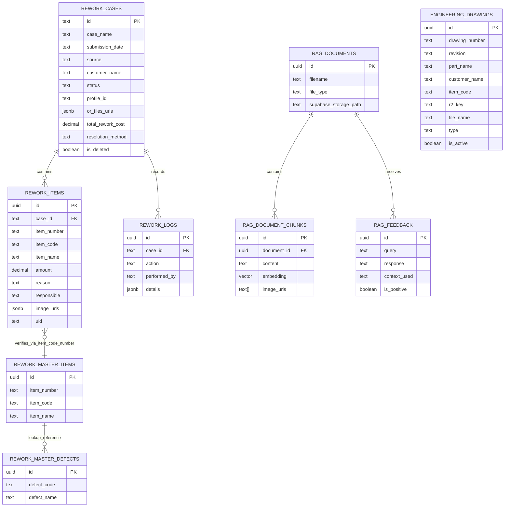

# Rework Database EDR (Entity Relationship Diagram)

This ERD summarizes the main database entities that support the Rework workflow, document control, and AI-assisted search.

## Mermaid ERD

## Core Tables and Purpose

| Table | Purpose |
|---|---|
| `rework_cases` | Main operational case record for rework workflow |
| `rework_items` | Line items inside each case, with defect and responsible details |
| `rework_logs` | Audit trail for every change and status transition |
| `rework_master_items` | Reference master item data for item verification |
| `rework_master_defects` | Reference defect list for reason selection |
| `engineering_drawings` | Revision-controlled document metadata for drawings and masters |
| `rag_documents` | Uploaded document metadata for AI search |
| `rag_document_chunks` | Embedded content chunks for semantic retrieval |
| `rag_feedback` | User feedback for RAG quality improvement |

## Important Business Relationships

- One rework case can contain many rework items.
- One rework case can have many audit logs.
- Rework items are verified against master item data by `item_number` and `item_code`.
- Engineering drawings are versioned by drawing number and revision.
- RAG documents are split into chunks for semantic search and retrieval.

## Presentation Notes

Use this EDR to explain that the project is not just a simple CRUD app; it is a traceable, role-aware, and extensible quality operations platform.
