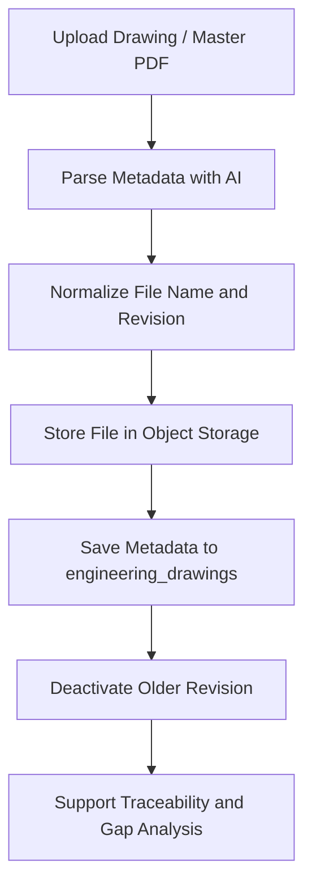
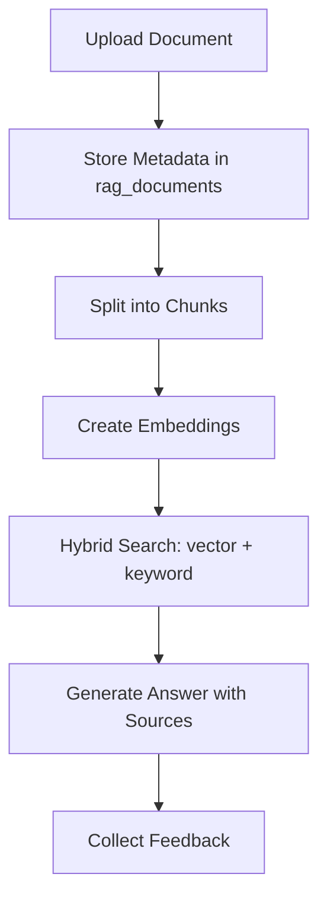
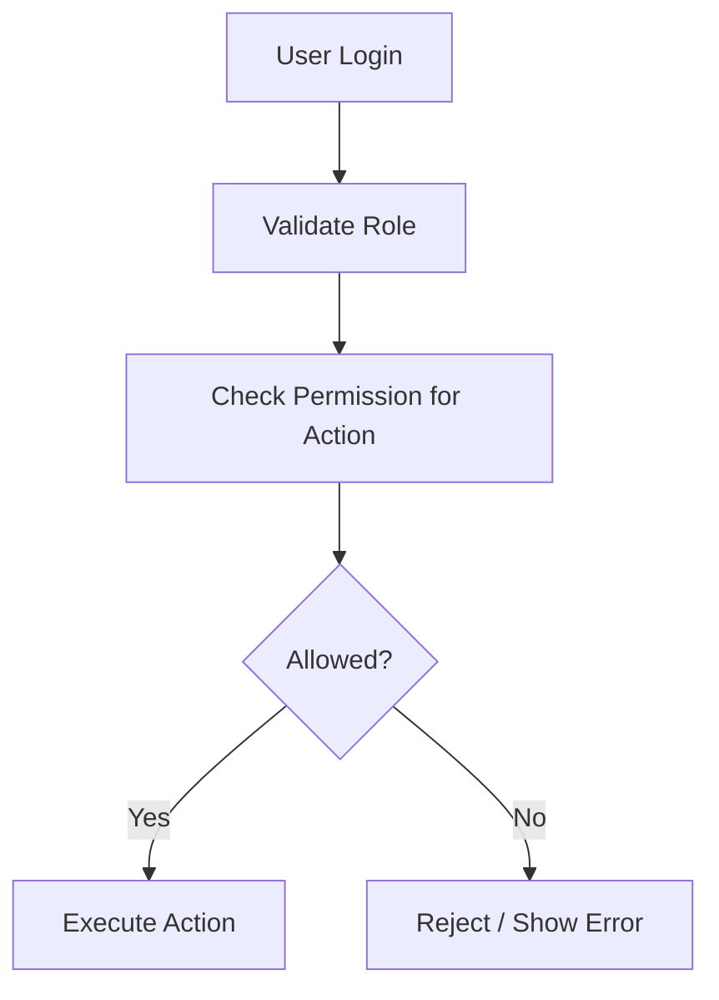

# Rework System – Presentation-Ready Module Workflows

This document summarizes the actual workflow of the QSMS Rework system based on the current code and database schema.

## 1. Rework Module (Core Workflow)

```mermaid
flowchart TD
    A[Login / Select Role] --> B[Open Portal]
    B --> C[Create Rework Case]
    C --> D[Upload OR Evidence]
    D --> E[Add Item(s)]
    E --> F[Verify Item Against Master Data]
    F --> G[Save Case + Items]
    G --> H[Update Status]
    H --> I[Fill Valuation / Cost]
    I --> J[Complete / Archive Case]
```

### Key steps
- Create case with metadata: source, customer, batch, packaging date, mold, status.
- Attach evidence images and OR files.
- Add one or more rework items with reason, responsible party, amount, line, and notes.
- Verify each item against `rework_master_items`.
- Save case and items into Supabase.
- Update workflow status from Pending → In-Progress → Awaiting Valuation → Completed.
- Log every meaningful state change in `rework_logs`.

### Backend actions used
- `insertCase`
- `updateCaseStatus`
- `verifyItem`
- `saveItemMaster`
- `loadMasterData`
- `deleteCase`

---

## 2. Storage / Drawing Control Module



### Key steps
- Upload drawing or master files.
- Extract metadata such as drawing number, revision, part name, customer, item code.
- Save the file to object storage and record metadata in `engineering_drawings`.
- Mark previous revisions inactive to preserve history.
- Use the stored metadata to support revision control and document traceability.

---

## 3. DocAI RAG Module



### Key steps
- Upload documents into the RAG pipeline.
- Save metadata and content into `rag_documents`.
- Split content into chunks and create embeddings in `rag_document_chunks`.
- Query with hybrid search for semantic and keyword recall.
- Return a streaming-style answer with source references.
- Record feedback for quality improvement.

---

## 4. Authentication / Permission Module



### Roles in the current system
- `QSMS`: full access to create, edit, delete, update status, valuation, export.
- `OPERATOR`: create cases and update status.
- `FINANCE`: valuation only.

---

## 5. Cross-Module Story for Presentation

The system is not just a form app; it is a quality operations workspace where:
- Rework manages operational cases.
- Storage provides document and revision control.
- RAG helps users search and understand engineering knowledge.
- Auth and permissions ensure every action is controlled.

This combination gives the project strong operational traceability and future extensibility.
