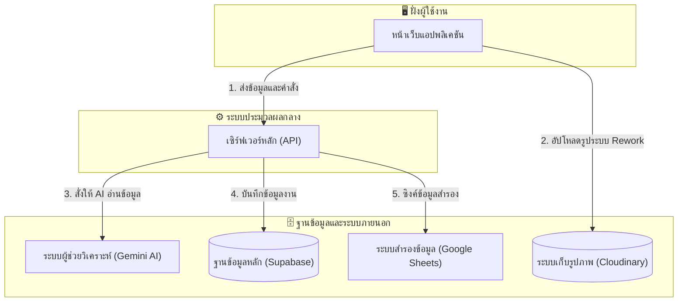
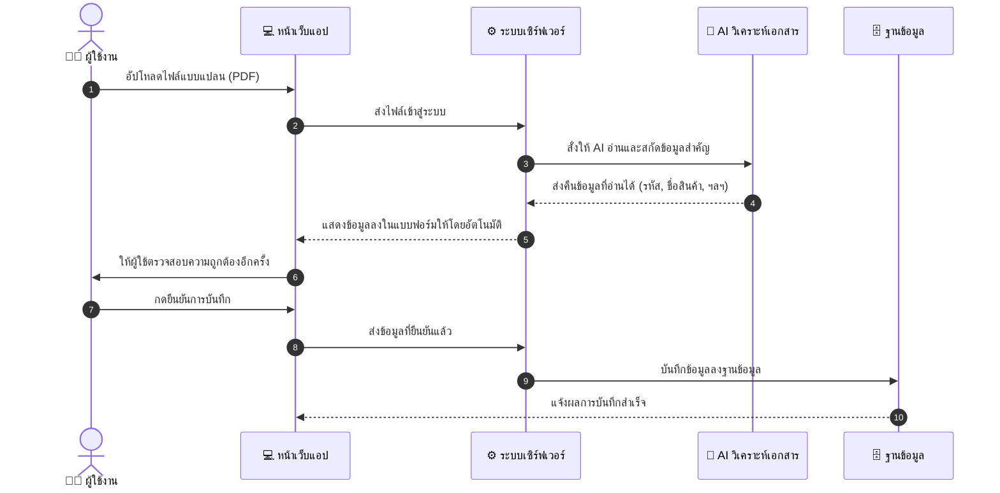
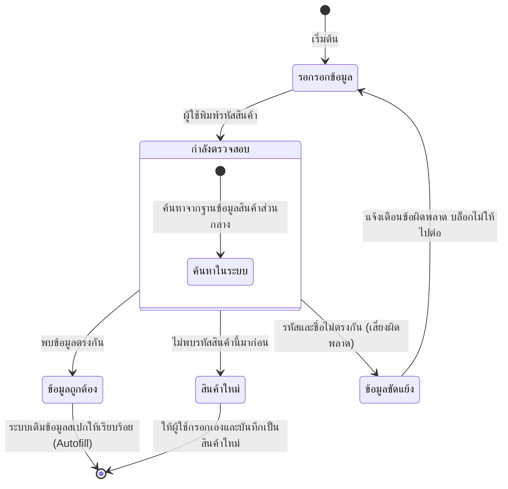
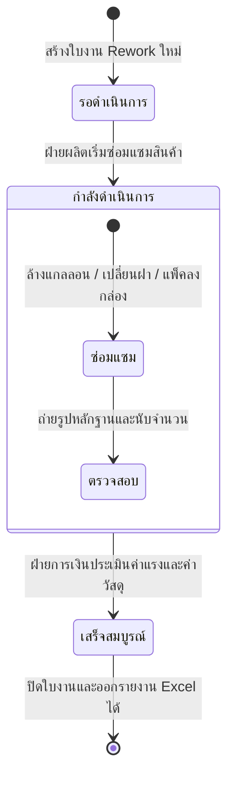
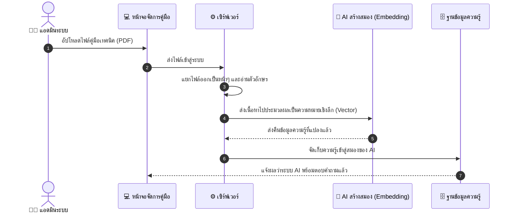
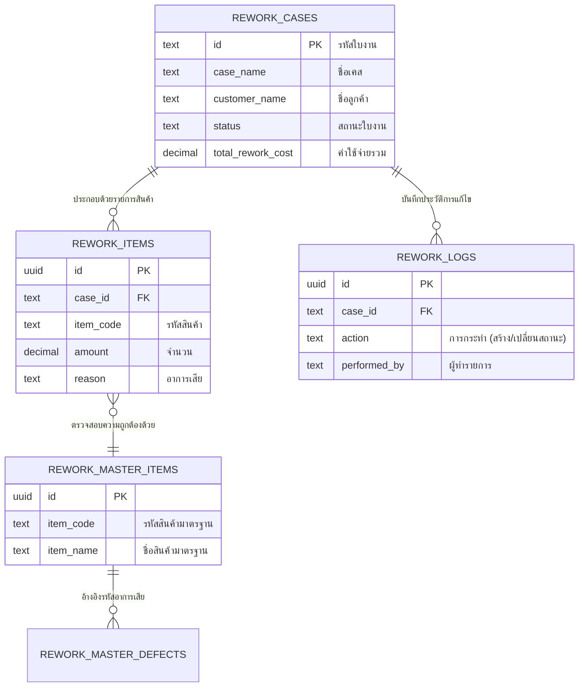
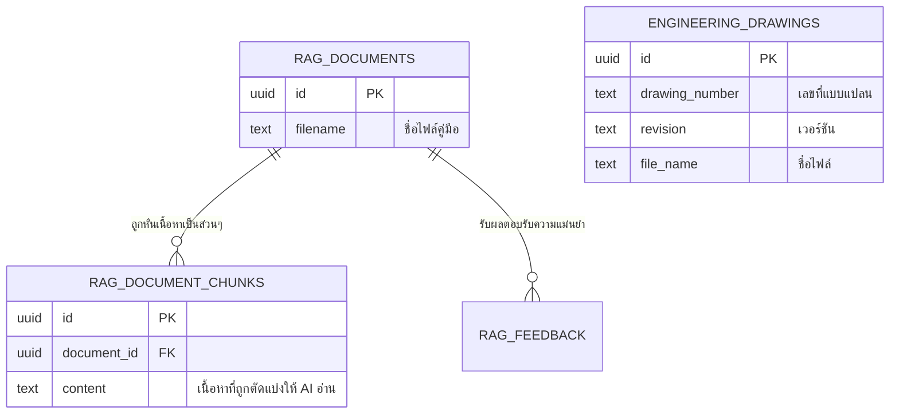

# แผนผังกระแสการทำงานระบบ (QSMS System Flow Diagrams)

แผนผังเหล่านี้ถูกปรับปรุงให้ใช้คำศัพท์ที่ **เข้าใจง่าย (User-friendly)** และลดความซับซ้อนเชิงเทคนิคลง เพื่อให้นำไปใช้ประกอบการนำเสนอ (Presentation) หรือใส่ในเล่มรายงานวิทยานิพนธ์ได้อย่างสวยงามและสื่อสารได้ชัดเจนยิ่งขึ้นครับ

---

## 1. ภาพรวมการทำงานของระบบ (Overall System Architecture)

---

## 2. ขั้นตอนการทำงานของ AI ช่วยอ่านแบบแปลน (AI Document OCR Workflow)

---

## 3. ระบบช่วยตรวจสอบและป้องกันข้อมูลผิดพลาด (Smart Verification)

---

## 4. วงจรชีวิตการทำงานของงาน Rework (Rework Case Lifecycle)

---

## 5. กระบวนการนำเข้าคู่มือเพื่อสอน AI (AI Knowledge Ingestion)

---

## 6. แผนภาพความสัมพันธ์ของฐานข้อมูล (Database ERD)

เนื่องจากระบบถูกแบ่งส่วนฐานข้อมูลออกจากกันอย่างชัดเจนตามขอบเขตการทำงาน (Bounded Context) แผนภาพจึงถูกแยกออกเป็น 2 ส่วนหลัก ดังนี้:

### 6.1 ฐานข้อมูลระบบจัดการงาน Rework (Rework Management DB)

### 6.2 ฐานข้อมูลระบบเอกสารและคู่มือ AI (Document & Knowledge DB)

