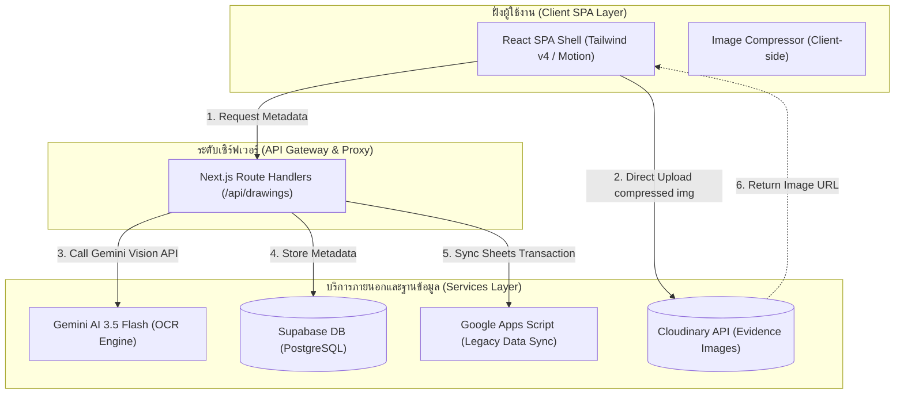
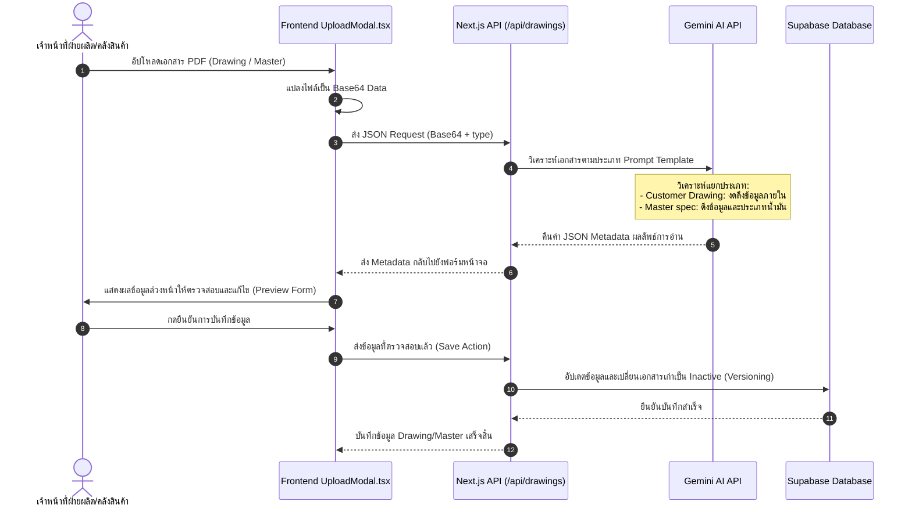
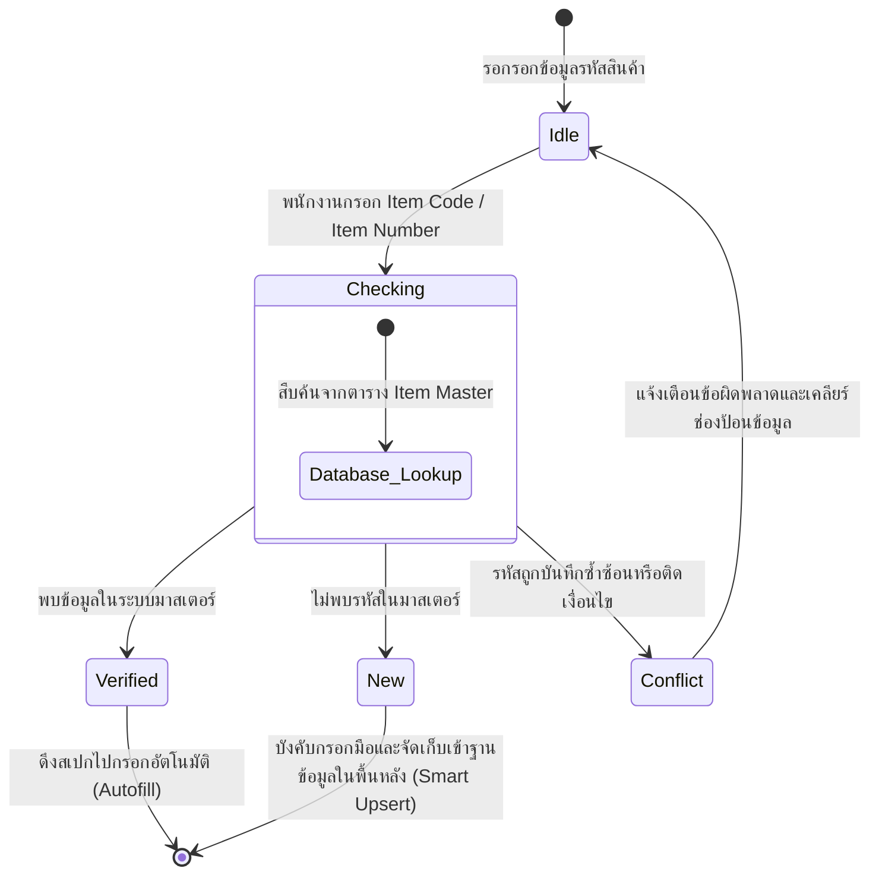
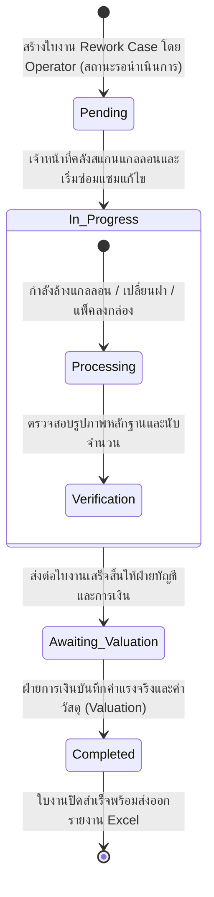
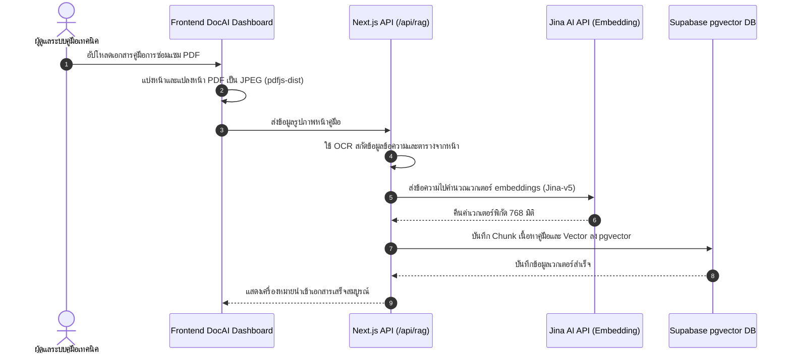

# แผนผังกระแสการทำงานระบบ (QSMS System Flow Diagrams)

แผนผังเหล่านี้เขียนขึ้นโดยใช้ไวยากรณ์ **Mermaid.js** ซึ่งคุณสามารถคัดลอกโค้ดไปแสดงผลในสไลด์นำเสนอ เล่มรายงาน (Markdown) หรือโปรแกรมที่รองรับได้ทันที

---

## 1. แผนผังโครงสร้างสถาปัตยกรรมระบบ (Overall System Architecture)

---

## 2. ลำดับขั้นตอนการวิเคราะห์และดึงข้อมูลแบบแปลน (AI Drawing/Master OCR Ingestion)

---

## 3. ผังสถานะระบบตรวจสอบข้อมูลสินค้าอัตโนมัติสองทาง (Two-Way Verification States)

---

## 4. แผนผังกระบวนการดำเนินงานของ Rework Case (Rework Case Lifecycle)

---

## 5. กระบวนการนำเข้าเอกสารความรู้ของระบบคู่มืออัจฉริยะ (DocAI RAG Ingestion Pipeline)

